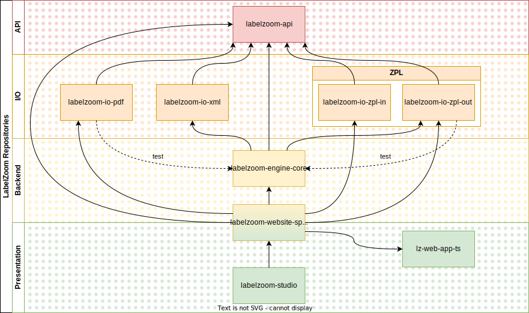

# labelzoom
LabelZoom is the world's premier barcode label conversion and design platform. For more information about our various products and services, please visit [labelzoom.net](https://www.labelzoom.net).

This repository is primarily used for documentation and orientation around the various LabelZoom source code repositories. Additionally, it will be used to document our progress as we look for opportunities to migrate toward open source.

## Dependency Graph
The following diagram illustrates the dependencies of various LabelZoom repositories and packages:

## Repositories
- Code samples for invoking web requests
  - 🌎[groovy-zpl-utils](https://github.com/labelzoom/groovy-zpl-utils)
  - 🌎[python-zpl-utils](https://github.com/labelzoom/python-zpl-utils)
- LabelZoom API (data model, interfaces, & utilities)
  - 🔒[labelzoom-api](https://github.com/labelzoom/labelzoom-api)
- I/O adapters (convert labels to and from other formats)
  - XML/JSON
    - 🔒[labelzoom-io-xml](https://github.com/labelzoom/labelzoom-io-xml)
  - PDF
    - 🔒[labelzoom-io-pdf](https://github.com/labelzoom/labelzoom-io-pdf)
  - ZPL
    - 🔒[labelzoom-io-zpl-in](https://github.com/labelzoom/labelzoom-io-zpl-in)
    - 🔒[labelzoom-io-zpl-out](https://github.com/labelzoom/labelzoom-io-zpl-out)
- Products
  - LabelZoom website and web services
    - 🔒[labelzoom-website-spring](https://bitbucket.org/labelzoom/labelzoom-website-spring/src/master/)
    - 🔒[labelzoom-website-spring-private](https://bitbucket.org/labelzoom/labelzoom-website-spring-private)
    - 🔒[lz-web-app-ts](https://bitbucket.org/labelzoom/lz-web-app-ts)
  - Client applications
    - 🔒[labelzoom-studio](https://bitbucket.org/labelzoom/labelzoom-studio)
